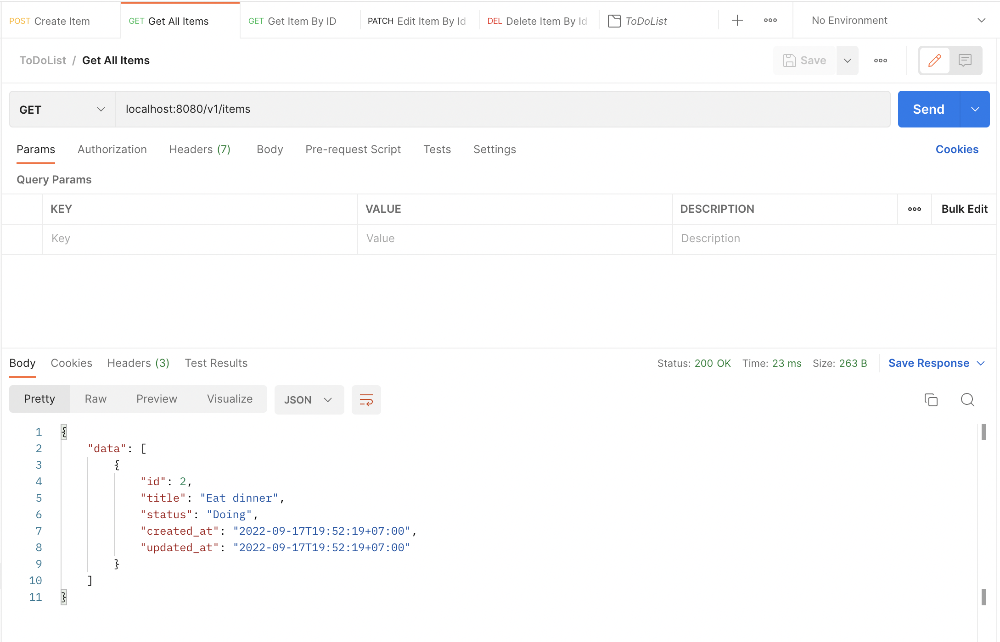
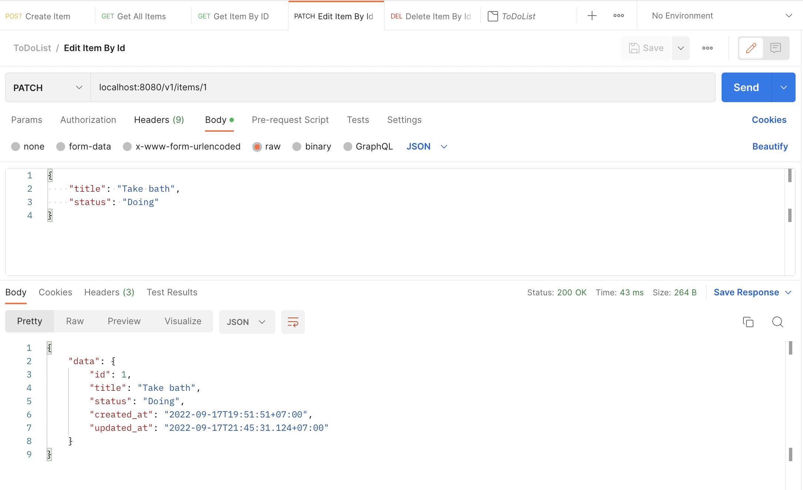
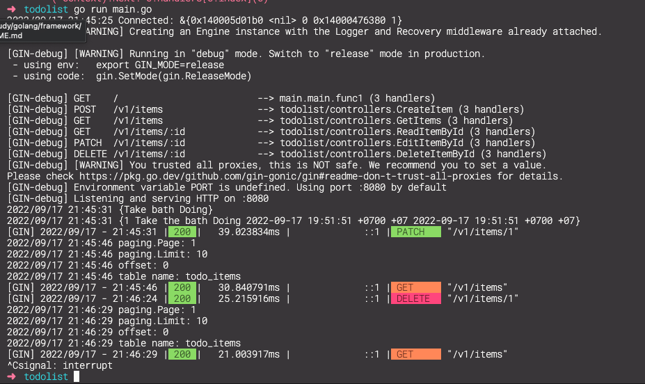

## Study Gin and Gorm with Golang

## Prepare MySQL

```sh
docker run -d --name demo-mysql -p 3306:3306 -e MYSQL_ROOT_PASSWORD=my-root-pass -e MYSQL_DATABASE=todo_db mysql:8.0
```

## Create table

```sh
CREATE TABLE `todo_items` (
  `id` int NOT NULL AUTO_INCREMENT,
  `title` varchar(150) CHARACTER SET utf8 NOT NULL,
  `status` enum('Doing','Finished') DEFAULT 'Doing',
  `created_at` timestamp NOT NULL DEFAULT CURRENT_TIMESTAMP,
  `updated_at` timestamp NOT NULL ON UPDATE CURRENT_TIMESTAMP,
  PRIMARY KEY (`id`)
) ENGINE=InnoDB DEFAULT CHARSET=utf8mb4;
```

## Test with postman



